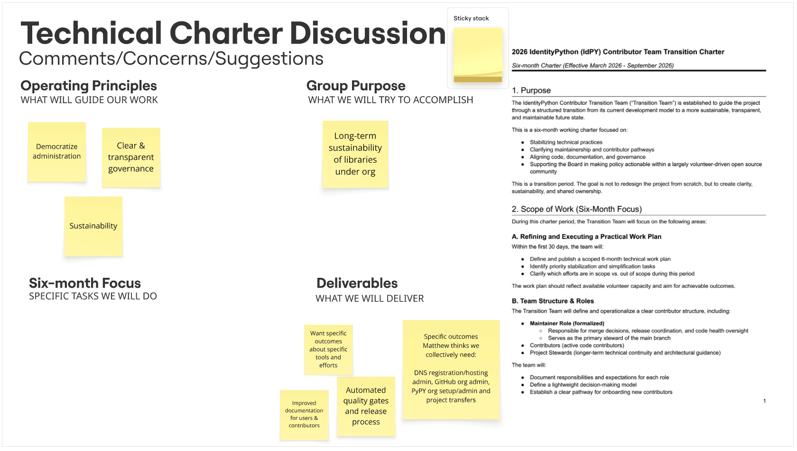
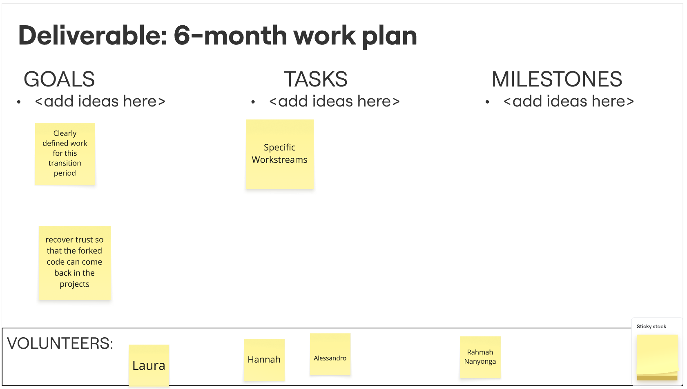
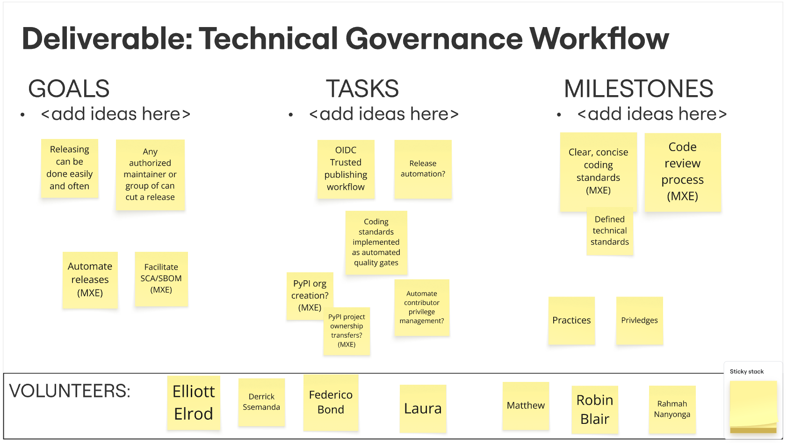
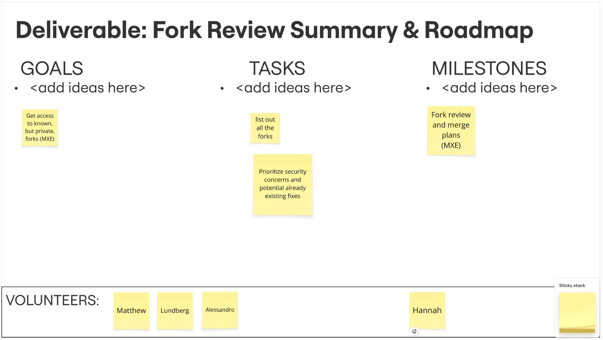
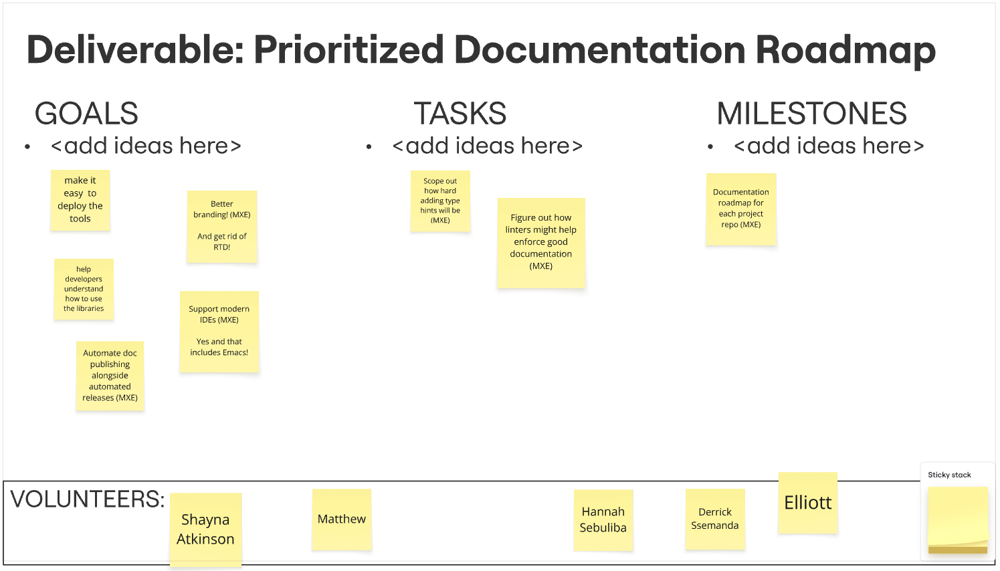

# IdPY Technical Re-kickoff Meeting
*Jun 26, 2026 | Also available: [PDF version](2026-06-26%20IdPy%20Technical%20Re-Kickoff%20NOTES%20-%20Google%20Docs.pdf)*

# **LOGISTICS**

* Google Meet: [meet.google.com/uki-sjns-pzd](http://meet.google.com/uki-sjns-pzd)   
* Pre-Work: Read [Technical Transition Charter](https://github.com/IdentityPython/Meetings/blob/851cc1a908c837713c0d4afdef4271fe521b5466/2026-06-26%20DRAFT%20IdPY%20Technical%20Transition%20Charter.pdf)  
* Interactive Miro Board: [https://bit.ly/3SqYcEg](https://bit.ly/3SqYcEg) PW: idpy2026  
* Notes Document: [In Google Docs](https://docs.google.com/document/d/1Z5JAilk4mdXcyBa8Yko9dkI7lxEjLweNWSHEdqoctow/edit?usp=sharing)

# **AGENDA**

	5 min	Introductions

	5 min	Review & Agree to the Agenda

	15 min	Questions and initial reactions to the charter document (see below) 

	25 min	Planning the next 6 months (an interactive exercise) (LINKS TO TOPICS & NOTES ⬇️)

	10 min	How we will organize to get the 6-month plan done \- norms review/ meeting cadence

		Adjourn

## Topics Discussed
* [General Comments about the Technical Charter](#general-comments-about-the-technical-charter)
* [DISCUSSION: Deliverable: 6-month work plan](#discussion-6-month-work-plan)
* [WORKSTREAM: GOVERNANCE](#workstream-governance)
* [WORKSTREAM: Fork Review Summary & Roadmap](#workstream-fork-review-summary--roadmap)
* [WORKSTREAM: Prioritized Documentation Roadmap](#workstream-prioritized-documentation-roadmap)
* [Next steps](#next-steps)

# **ATTENDANCE**

| Name               | Org | IdPy Involvement |
|:-------------------| :---- | :---- |
| Laura P            | RDCT | IdPy Coordination |
| Matthew X E        | RDCT | Just another Perl^H^H^H^H^H Python hacker |
| Robin B            | Engineer@
NCSA/CILogon |  |
| Elliott E          | RDCT |  |
| Federico B         | Software Engineer @ Signatura | interests: pysaml2; python saml ecosystem health |
| Derrick S          | Systems Engineer, RENU |  |
| Lundberg           | Developer @ Sunet |  |
| Shayna A           | CILogon |  |
| Hannah S           | Developer @ RDCT |  |
| Alessandro D | Developer @ Sunet |  |

# **NOTES**

*Also see [AI-generated Meeting Summary](#ai-generated-meeting-summary)*

## **General Comments about the Technical Charter**

Also visible in [Miro](https://miro.com/app/board/uXjVHB5B-ZQ=/?moveToWidget=3458764676607659827&cot=14) PW: idpy2026

* [Six-Month Technical Transition Charter](https://github.com/IdentityPython/Meetings/blob/851cc1a908c837713c0d4afdef4271fe521b5466/2026-06-26%20DRAFT%20IdPY%20Technical%20Transition%20Charter.pdf)   
* Operating Principles (What will guide our work)  
  * Democratize administration  
  * Clear & transparent governance  
  * Sustainability  
* Group Purpose (What we will try to accomplish)  
  * Long-term sustainability of libraries under org  
* Deliverables (What we will deliver)  
  * Want specific outcomes about specific tools and efforts  
  * Improved documentation for users & contributors  
  * Automated quality gates and release process  
  * Specific outcomes Matthew thinks we collectively need:  
    * DNS registration/hosting admin,   
    * GitHub org admin,   
    * PyPY org setup/admin and   
    * project transfers

## **DISCUSSION: 6-month work plan**

  

Also visible in [Miro](https://miro.com/app/board/uXjVHB5B-ZQ=/?moveToWidget=3458764676607659828&cot=14) PW: idpy2026

* This deliverable is primarily about the logistics of engaging this group in the work over the next 6-months  
* There was limited discussion about this topic during the meeting  
* VOLUNTEERS: *Laura, Hannah, Alessandro, Rahmah Nanyonga*  
* GOALS:   
  * Clearly defined work for this transition period  
  * recover trust so that the forked code can come back into the projects  
* TASKS  
  * Set up specific workstreams (see below) 	

## **WORKSTREAM: GOVERNANCE**

  

Also visible in [Miro](https://miro.com/app/board/uXjVHB5B-ZQ=/?moveToWidget=3458764676609556240&cot=14) PW: idpy2026

* COMBINED the deliverables: *Functioning Maintainer Model | Technical Governance Workflow*  
* VOLUNTEERS: *Elliot, Derrick, Federico, Laura, Matthew, Robin, Alessandro*

* GOALS  
  * Clear contributor ladder  
  * Documentation release process  
  * Vulnerability report process  
  * Documented contributor guidelines  
  * Releasing can be done easily and often  
  * Any authorized maintainer or group can cut a release  
  * Automate releases  
  * Facilitate [SCA/SBOM](https://www.practical-devsecops.com/sbom-vs-sca/)  
* TASKS   
  * OIDC Trusted publishing workflow  
  * Release automation?  
  * Coding standards implemented as automated quality gates  
  * PyPI org creation? | PyPI project ownership transfers?  
  * Automate contributor privilege management?  
* MILESTONES   
  * Clear, concise coding standards | Defined technical standards  
  * Code review process  
  * Practices  
  * Privileges

## **WORKSTREAM: Fork Review Summary & Roadmap**

Also visible in [Miro](https://miro.com/app/board/uXjVHB5B-ZQ=/?moveToWidget=3458764676609556437&cot=14) PW: idpy2026

* VOLUNTEERS: *Matthew, Lundberg, Alessandro, Hannah*  
* GOALS  
  * Get access to known but private forks  
* TASKS  
  * List out all the forks  
  * Prioritize security concerns and potential already existing fixes  
* MILESTONES  
  * Fork review and merge plans

## **WORKSTREAM: Prioritized Documentation Roadmap**

Also visible in [Miro](https://miro.com/app/board/uXjVHB5B-ZQ=/?moveToWidget=3458764676609556699&cot=14) PW: idpy2026

* VOLUNTEERS: *Shayna, Matthew, Hannah, Derrick, Elliott, Alessandro*  
* GOALS  
  * Make it easy to deploy the tools  
  * Help developers understand how to use the libraries  
  * Automate doc publishing alongside automated releases  
  * Better branding | and get rid of RTD\!  
  * Support modern IDEs | Yes and that includes Emacs\!  
* TASKS  
  * Scope out how hard adding type hints will be  
  * Figure out how linters might help enforce good documentation  
  * A personal goal is to get into the GitHub repository and familiarize myself with the documentation \[Elliott Elrod\]  
* MILESTONES  
  * Documentation roadmap for each project repo

## **Next steps** {#next-steps}

* GOALS: Coordination Meetings — People know when meetings are and feel welcome to attend  
* TASKS:   
  * Clean up mailing lists  
  * Re-engage Slack channels  
  * Project management  
  * Task oversight  
* Communicate this meeting to the community  
* Establish workstreams

---

Jun 26, 2026

# AI-Generated Meeting Summary

*Created using Gemini based on meeting transcript*

**Invited**: Warren G A;. Derrick S; Hannah S; Ivan K; Alessandro D; Matthew E; Lundberg; Immaculate A; Laura P; Robin B; Christos K; Lasse Y;  Shayna A; Michael J; Scott K; Rahmah N; Elliott E; Federico B; Vladimir M; Christopher W

**Attachments** [IdPY Technical Re-kickoff Meeting](https://calendar.google.com/calendar/event?eid=MHE1Z2I3MWdzNGZzOHF1amc0bWE1aHVrcXIgbHBhZ2xpb25lQHJlc2VhcmNoZGF0YS51cw)

### **Summary**

The meeting established a six month project roadmap and organized working groups for governance and technical deliverables.

**Strategic Planning and Charter**  
The meeting launched a six month project planning period focused on technical deliverables. Participants reviewed the project charter and identified the need for specific, practical operational outcomes.

**Workstream Structure**  
The group decided to organize into four working streams covering transition planning, integration, documentation, and governance. This structure aims to clarify contributor roles and project management.

**Technical and Documentation Focus**  
Discussions highlighted the need for improved software release discipline and better documentation processes. Participants reached a consensus to dedicate resources toward these infrastructure improvements.

### **Decisions**

> Aligned

* **Project work organized into three streams** The project work is organized into three distinct work streams: technical governance and maintainer model, fork review, and documentation.

* **Workgroup meeting structure established** The project will move forward using a structure of three workstream-specific meetings, allowing participants to attend sessions based on their interests.

### **Next steps**

- [ ] \[Laura P\] Create work stream documents: Generate three separate documents for the governance, fork review, and documentation work streams. Grant access to all team members for collaborative contributions.

- [ ] \[The group\] Define subgroup goals: Establish specific milestones and collaborative workflows for the 6-month planning period within each assigned subgroup. Outline clear deliverables for community presentation.

- [ ] \[Laura P\] Schedule Sessions: Arrange three separate sessions to initiate the workflow for each designated area. Coordinate the organizational structure and frequency of interactions within these smaller groups.

- [ ] \[The group\] Update Google Doc: Navigate to the shared document to verify or modify personal contact information associated with specific project areas.

- [ ] \[Laura P\] Send Summary: Distribute a summary of today's discussion to all participants.

- [ ] \[Laura P\] Prepare Invites: Finalize the calendar invitations for the 3 upcoming work area sessions.

### **Details**

* **Meeting Setup and Technical Logistics**: The meeting began with participants troubleshooting technical access issues regarding Google Meet and a collaborative Mural board . Laura P noted that the session was being transcribed but not recorded, and assigned Matthew E to assist with note-taking . Because some participants could not access the Mural board, Laura P provided a Google Doc as an alternative platform for collaboration .

* **Purpose and Agenda Overview**: Laura P described the meeting as a "re-kickoff" intended to reinvigorate the project and initiate a six-month planning period . Participants were asked to review the proposed agenda, during which Matthew E inquired if the six-month planning was focused exclusively on transition planning . Laura P confirmed that this period would be used for the group to plan the remaining project work.

* **Introductions and Accessibility Challenges**: Participants introduced themselves, with some, including Elliott E and Rahmah Nanyonga, reporting difficulties interacting with the Mural board . Laura P reiterated that participants should use the provided Google Doc if the Mural interface was inaccessible, and Matthew E assisted by pasting the necessary links into the chat .

* **Technical Charter Review**: Laura P introduced the technical charter, which covered operating principles, the group's purpose, the six-month focus, and deliverables . The group was invited to provide comments on the charter content, though an in-depth review was postponed in the interest of time .

* **Concerns Regarding Low-Level Operational Outcomes**: Matthew E expressed that the technical charter was too high-level and requested guidance on where to document specific, practical outcomes, such as the ability for the group to collectively manage DNS, GitHub, and Pi access . Laura P acknowledged this feedback and suggested collecting further input before addressing the specifics.

* **Governance and Release Discipline Proposals**: Federico B, who manages an enterprise software business relying on Python and SAML libraries, discussed the poor state of SAML implementations in the Python ecosystem . They proposed creating work streams for a governance model—specifically establishing a contributor ladder—and implementing release discipline to make the release process less burdensome and more frequent .

* **Proposed Work Streams**: Laura P proposed organizing the group into four working streams based on the charter’s deliverables: the transition plan, fork review and integration roadmap, documentation roadmap, and governance . The group agreed to proceed with this structure, with participants indicating their interest in specific areas.

* **Working Session on Deliverables**: Participants spent time populating the Mural board and Google Doc with their ideas and interests for the identified work streams . Laura P clarified that this session was intended to help identify which areas participants wanted to contribute to and how they planned to engage with the work.

* **Clarifying the Functioning Maintainer Model and Technical Governance**: Federico B and Matthew E discussed the overlap between the "functioning maintainer model" and "technical governance" . Matthew E explained that "SCA" stands for Software Component Analysis and "SBOM" stands for Software Bill of Materials, which they argued should be part of the governance work to establish secure, documented release processes.

* **Fork Review and Integration Roadmap**: The group discussed the fork review and integration roadmap. Laura P explained that the objective is to review known private forks and develop a plan for potential integration, rather than performing the actual code merging during the initial six-month planning phase. While Matthew E questioned whether organizations with private forks would be willing to share them, Laura P noted that while some organizations acknowledged the integration challenges, none had refused to cooperate.

* **Documentation Roadmap**: The goals for the documentation work stream included making tools easier to deploy, improving branding, and implementing automated documentation publishing alongside releases. Matthew E emphasized that documentation was a critical weak spot for the project and expressed a desire to prioritize this area.

* **Coordination and Project Management Needs**: Matthew E suggested that the group needed project management tools—such as task boards—in addition to regular coordination meetings and Slack channels to organize their work effectively. Laura P acknowledged the necessity of this support, noting that all participants are managing this project alongside other professional obligations.

* **Next Steps and Deliverables Strategy**: Laura P concluded the meeting by outlining the next steps, which included creating dedicated documents for each of the identified work streams. These documents would be used to outline specific goals to be achieved by the end of the six-month period and to define how each subgroup would choose to collaborate. Laura P confirmed that the group was prepared to be responsible for creating documentation and strategies for these areas.

* **Project Scope and Participation Commitment**: Laura P initiates a discussion regarding the expected time commitment for the project, which is estimated to be a six-month effort involving a single document with multiple contributors. Participants are given the opportunity to opt-out or adjust their level of involvement if they are unable to commit to these requirements. Alessandro D, speaking on behalf of Sunnet, explains that they cannot currently quantify the exact amount of time they can dedicate to the project but expects to have more clarity after the summer, while confirming their overall intention to remain involved.

* **Proposed Meeting Structure and Organization**: To facilitate the workflow, Laura P proposes setting up three separate meetings, which participants may attend based on their specific areas of interest. These sessions are intended to serve as a starting point where each group can determine their own organizational structure, meeting frequency, and work outlines. Additionally, these meetings will allow for the assignment of tasks based on the specific interests and expertise of the participants.

* **Process Feedback and Conclusion**: As the meeting time concludes, Laura P asks participants to provide feedback on the process and project direction via a Google slide. The visual feedback indicates that participants are optimistic and in agreement with the trajectory of the work. Laura P confirms they will send out meeting notes and initiate the three scheduled meetings based on the lists provided in the Google doc. Participants are instructed to review the Google doc to ensure their names are listed in the correct areas before the next phase of the project begins.