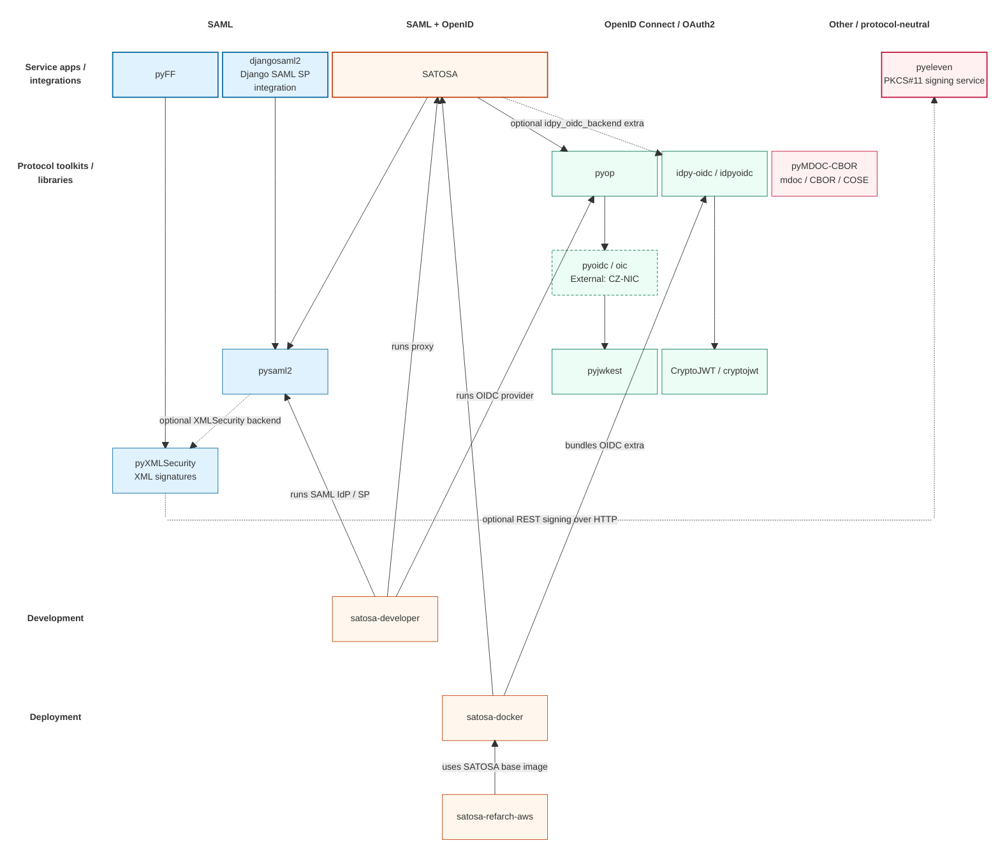

```mermaid
block-beta
    columns 9
    space SAML["SAML"]:2 Shared["SAML + OpenID"]:2 OpenID["OpenID Connect / OAuth2"]:2 Other["Other / protocol-neutral"]:2
    Services["Service apps /<br/>integrations"] FF["pyFF"] Django["djangosaml2<br/>Django SAML SP<br/>integration"] SATOSA["SATOSA"]:2 space:3 P11["pyeleven<br/>PKCS#11 signing service"]
    space:9
    Libraries["Protocol toolkits /<br/>libraries"] space:4 OP["pyop"] OIDC["idpy-oidc / idpyoidc"] MDOC["pyMDOC-CBOR<br/>mdoc / CBOR / COSE"] space
    space:9
    space:5 Pyoidc["pyoidc / oic<br/>External: CZ-NIC"] space:3
    space:9
    space:2 PySAML["pysaml2"] space:2 JWK["pyjwkest"] JWT["CryptoJWT / cryptojwt"] space:2
    space:9
    space XML["pyXMLSecurity<br/>XML signatures"] space:7
    space RestLeft((" ")) space:6 RestRight((" "))
    space:9
    Development["Development"] space:2 Dev["satosa-developer"] space:5
    space:9
    Deployment["Deployment"] space:3 Docker["satosa-docker"] space:4
    space:9
    space:4 AWS["satosa-refarch-aws"] space:4

    Django --> PySAML
    SATOSA --> PySAML
    SATOSA --> OP
    SATOSA -. "optional idpy_oidc_backend extra" .-> OIDC
    OIDC --> JWT
    OP --> Pyoidc
    Pyoidc --> JWK
    FF --> XML
    PySAML -. "optional XMLSecurity backend" .-> XML
    XML -.- RestLeft
    RestLeft -. "optional REST signing over HTTP" .- RestRight
    RestRight -.-> P11
    Docker --> SATOSA
    Docker -- "bundles OIDC extra" --> OIDC
    AWS -- "uses SATOSA base image" --> Docker
    Dev -- "runs proxy" --> SATOSA
    Dev -- "runs SAML IdP / SP" --> PySAML
    Dev -- "runs OIDC provider" --> OP

    classDef axis fill:none,stroke:none,color:#475569,font-weight:bold
    classDef route fill:none,stroke:none,color:transparent,r:0.5px
    classDef service fill:#e0f2fe,stroke:#0369a1,color:#0c4a6e,stroke-width:2px
    classDef library fill:#ecfdf5,stroke:#047857,color:#064e3b
    classDef external fill:#ffffff,stroke:#64748b,color:#334155,stroke-dasharray:5 3
    classDef development fill:#fff7ed,stroke:#c2410c,color:#9a3412
    classDef deployment fill:#f1f5f9,stroke:#64748b,color:#334155
    classDef saml fill:#e0f2fe,stroke:#0369a1,color:#0c4a6e
    classDef shared fill:#fff7ed,stroke:#c2410c,color:#9a3412
    classDef openid fill:#ecfdf5,stroke:#047857,color:#064e3b
    classDef other fill:#fff1f2,stroke:#be123c,color:#881337
    classDef samlHeading fill:none,stroke:none,color:#0369a1,font-weight:bold
    classDef sharedHeading fill:none,stroke:none,color:#c2410c,font-weight:bold
    classDef openidHeading fill:none,stroke:none,color:#047857,font-weight:bold
    classDef otherHeading fill:none,stroke:none,color:#be123c,font-weight:bold
    class SAML,Shared,OpenID,Other,Services,Libraries,Development,Deployment axis
    class RestLeft,RestRight route
    class SATOSA,FF,P11,Django service
    class PySAML,OP,OIDC,JWT,JWK,XML,MDOC library
    class Pyoidc external
    class Dev development
    class Docker,AWS deployment
    class FF,Django,PySAML,XML saml
    class SATOSA,Dev,Docker,AWS shared
    class OP,OIDC,Pyoidc,JWK,JWT openid
    class P11,MDOC other
    class SAML samlHeading
    class Shared sharedHeading
    class OpenID openidHeading
    class Other otherHeading
```